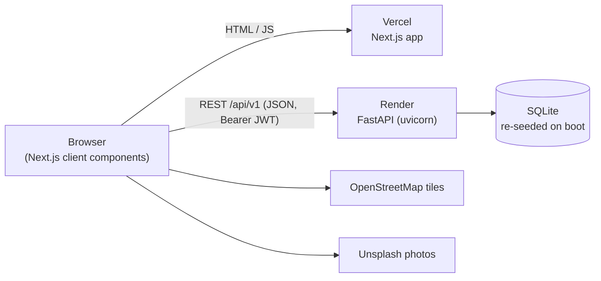
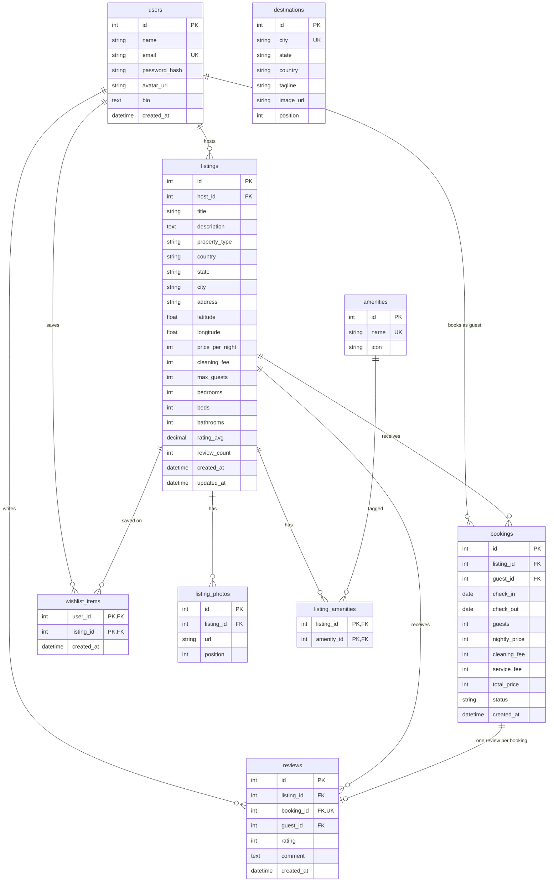

# Airbnb Clone

A full-stack Airbnb clone: browse and search stays across India, filter them, view a listing with its photos, reviews and map, book with a mocked checkout, manage trips and wishlists, and host your own listings. The UI follows Airbnb's web app closely, including dark mode and phone/tablet layouts. Prices are in INR (₹).

- **Frontend:** Next.js on Vercel (`frontend/`)
- **Backend:** FastAPI + SQLite on Render (`backend/`)

## Contents

- [Features](#features)
- [Tech stack](#tech-stack)
- [Architecture](#architecture)
- [Local setup](#local-setup)
- [Environment variables](#environment-variables)
- [Deployment](#deployment)
- [Database](#database)
- [API](#api)
- [Demo credentials](#demo-credentials)
- [Assumptions and limitations](#assumptions-and-limitations)
- [Smoke test checklist](#smoke-test-checklist)

## Features

- **Home:** All / Homes / Experiences / Services tabs, "Destinations for you", "Popular homes in {city}" and "Browse by type of stay" rows (with "Guest favourite" badges). Every card opens the results for that city or type.
- **Results (`/search`):** split list/map view with ₹ price pins, infinite scroll, amenity tabs in the header (only the amenities that stays in the current search offer) that toggle the amenity filter, and a Filters modal (price histogram, property type, bedrooms, amenities).
- **Search:** Where (debounced destination suggestions) → When (range calendar) → Who (guest steppers), all stored in the URL.
- **Listing detail:** photo mosaic + gallery, amenities, reviews with rating breakdown, location map, availability calendar and a live price breakdown.
- **Booking:** mocked checkout with card validation, double-booking protection, confirmation page, and trips (upcoming / past / cancelled) with cancellation and reviews for past stays.
- **Wishlist:** heart any listing (optimistic updates); guests are asked to log in first, then the save goes through.
- **Hosting:** dashboard with stats, a 7-step create/edit listing flow, reservations, and deletion that's blocked while upcoming stays exist.
- **Polish:** light/dark/system theme, phone layout (bottom tab bar, full-screen search, bottom-sheet filters, swipeable photos, sticky booking bar), tablet layouts, a toast for every API action, and custom 404, error and loading pages.

## Tech stack

| Layer | Tools |
|-------|-------|
| Frontend | Next.js 16 (App Router), React 19, TypeScript, Tailwind CSS v4, shadcn/ui (Base UI), TanStack Query v5, axios, sonner, next-themes, react-day-picker, react-leaflet + OpenStreetMap, date-fns |
| Backend | FastAPI, SQLAlchemy 2, Pydantic v2 / pydantic-settings, SQLite, JWT (python-jose), bcrypt, uvicorn |
| Hosting | Vercel (frontend), Render free tier (backend) |

## Architecture



All API calls come from the browser, so the frontend can be deployed anywhere static/edge. The backend URL is baked in at build time through `NEXT_PUBLIC_API_URL`.

### Frontend (`frontend/src/`)

```
app/            Routes (thin pages) + not-found / error / global-error / loading
components/     Feature UI: listings, search, listingDetail, booking, trips, wishlists, hosting, layout, …
queries/        TanStack Query hooks per resource; components import data hooks only from here
api/            Plain async functions per resource, built on api/client.ts (no React)
constants/      routes.ts (every route + builders, API paths), queryKeys.ts (key factory), app constants
common/i18n/    en.json + t(): every UI string, including toasts and validation
hooks/, utils/  Shared hooks (debounce, media query, snap carousel, …) and helpers (pricing, dates, storage)
```

How a request flows: component → `queries/*` hook → `api/*` function → `api/client.ts` (axios). The client:

- adds the Bearer token,
- converts camelCase ⇄ snake_case,
- shows the success toast for mutations (the backend `message`) and the error toast for any failure,
- clears the session on a 401.

Components never show toasts for API results themselves.

### Backend (`backend/app/`)

```
main.py         App, CORS, global error handlers ({ message, errors }), routers under /api/v1
core/           config (env settings), database (engine/session), security (bcrypt + JWT), init_db (create + seed)
models/         SQLAlchemy models
schemas/        Pydantic request/response models and query params
routers/        Thin HTTP layer; delegates to services
services/       Business logic: listings/search, availability, pricing, bookings, wishlist, host, reviews
seed/           Deterministic demo data (Indian cities, INR)
```

Booking creation locks, validates, checks for overlaps and inserts inside one write transaction (`BEGIN IMMEDIATE` on SQLite), so two guests can't book the same nights. Prices are always recomputed on the server, using the same formula the UI uses.

## Local setup

**Prerequisites:** Node.js 20+, Python 3.9+ (Render runs 3.12).

### Backend

```bash
cd backend
python3 -m venv .venv
source .venv/bin/activate          # Windows: .venv\Scripts\activate
pip install -r requirements.txt
cp .env.example .env
uvicorn app.main:app --reload --port 8000
```

On startup the API creates the tables and, if the database has no users, seeds the demo data (about a second). Health check: <http://localhost:8000/api/v1/health>. Interactive docs: <http://localhost:8000/docs>.

To start over, stop the server, delete `backend/airbnb.db` and start it again.

### Frontend

```bash
cd frontend
npm install
cp .env.example .env.local         # NEXT_PUBLIC_API_URL=http://localhost:8000
npm run dev                        # http://localhost:3000
```

### Checks

```bash
cd frontend && npm run lint && npm run typecheck && npm run build
cd backend && python -m compileall -q app
```

## Environment variables

### Backend (`backend/.env`, or Render env vars)

| Variable | Default | Purpose |
|----------|---------|---------|
| `DATABASE_URL` | `sqlite:///./airbnb.db` | SQLAlchemy URL |
| `SECRET_KEY` | `change-me-in-production` | JWT signing key (Render generates one) |
| `ACCESS_TOKEN_EXPIRE_MINUTES` | `10080` (7 days) | JWT lifetime |
| `CORS_ORIGINS` | `http://localhost:3000` | Comma-separated exact origins allowed to call the API (trailing slashes ignored) |
| `CORS_ORIGIN_REGEX` | – | Optional extra origins by regex, e.g. `https://airbnb-clone-.*\.vercel\.app` for Vercel previews |
| `SEED_ON_STARTUP` | `true` | Create tables + seed demo data when the database is empty |
| `DEBUG` | `false` | FastAPI debug mode |

### Frontend (`frontend/.env.local`, or Vercel env vars)

| Variable | Example | Purpose |
|----------|---------|---------|
| `NEXT_PUBLIC_API_URL` | `https://airbnb-clone-api.onrender.com` | Backend origin, without `/api/v1` (the app appends it). Inlined at build time: redeploy after changing it. |

## Deployment

Deploy the backend first (you need its URL for the frontend), then point the backend's CORS at the Vercel URL.

### 1. Backend on Render

**Option A, Blueprint:**

1. In Render, go to **New → Blueprint** and pick this repo. Render reads [`render.yaml`](render.yaml), which sets up:
   - a free Python web service with root dir `backend`,
   - Python 3.12,
   - a generated `SECRET_KEY`,
   - SQLite with seeding on startup,
   - the health check at `/api/v1/health`.
2. When prompted, set `CORS_ORIGINS` to your Vercel URL (you can fill it in after step 2 below). Optionally set `CORS_ORIGIN_REGEX` for preview deploys.

**Option B, manual web service:**

| Setting | Value |
|---------|-------|
| Root directory | `backend` |
| Runtime | Python 3 (set env `PYTHON_VERSION=3.12.8`) |
| Build command | `pip install -r requirements.txt` |
| Start command | `uvicorn app.main:app --host 0.0.0.0 --port $PORT` |
| Health check path | `/api/v1/health` |
| Env | `SECRET_KEY` (random), `CORS_ORIGINS`, optionally `CORS_ORIGIN_REGEX` |

Keep a single uvicorn worker, so the startup seed never runs twice against the same SQLite file.

### 2. Frontend on Vercel

1. Go to **Add New → Project** and import the repo. Set the **Root Directory** to `frontend`; the framework is detected as Next.js.
2. Add the env var `NEXT_PUBLIC_API_URL` with the Render URL, e.g. `https://airbnb-clone-api.onrender.com`. Set it for Production (and Preview if you use it).
3. Deploy, then copy the production URL into Render's `CORS_ORIGINS`. Saving the env var restarts the service.

## Database

SQLite through SQLAlchemy. `Base.metadata.create_all` creates the schema on startup (there are no migrations; the free tier starts from an empty file anyway).

### ER diagram



### Schema notes

| Table | Notes |
|-------|-------|
| `users` | Unique `email`; bcrypt `password_hash`. Every user can be a guest and a host. |
| `listings` | Money is whole rupees (`int`). `rating_avg` (2 dp) and `review_count` are recomputed from `reviews` whenever a review is added. Indexed on `city`, `price_per_night`, `property_type`. |
| `listing_photos` | Ordered by `position`; position 0 is the cover. |
| `amenities` / `listing_amenities` | Many-to-many join with a composite primary key. |
| `bookings` | `status` ∈ `confirmed`, `cancelled` (check constraint); `check_out > check_in` (check constraint); prices are snapshotted at booking time. Index on `(listing_id, check_in, check_out)` for overlap checks. Overlap rule: `new_check_in < existing_check_out AND new_check_out > existing_check_in` (back-to-back stays allowed). |
| `reviews` | `rating` 1–5 (check constraint); unique `booking_id` (one review per stay, only after checkout). |
| `wishlist_items` | Composite primary key `(user_id, listing_id)`. |
| `destinations` | Featured cities on the home page, ordered by `position`. Not linked by a foreign key: a destination is shown only while some listing has that `city`. |

Deleting a user or listing cascades to dependent rows (photos, bookings, reviews, wishlist links).

**Pricing:**

- total = nights × nightly price + cleaning fee + service fee
- service fee = 12% of (nights × nightly price + cleaning fee)

### Seed data

The same seed runs on every empty database, so every fresh boot gives the same demo. It uses a fixed random seed, and all dates are relative to today.

- 6 users (3 hosts, 3 guests). See [demo credentials](#demo-credentials).
- 152 listings, 8 in each of 19 cities: Goa, Jaipur, Udaipur, Mumbai, Bengaluru, Manali, Kochi, Delhi, Rishikesh, Pondicherry, Darjeeling, Shimla, Ooty, Munnar, Coorg, Varanasi, Agra, Hyderabad and Leh.
- 15 property types (Villa, Apartment, Cabin, Houseboat, Treehouse, Beachfront, Farmhouse, Heritage haveli, Camping, Cottage, Bungalow, Loft, Tiny home, Dome, Palace), picked per city to suit it (houseboats in Kochi, domes and camping in Leh).
- 6–8 photos per listing from a 10-photo set for its property type, rotated so listings of the same type lead with different photos. 8–12 amenities each (sea view and beach access only on the coast, mountain view and fireplace only in the hills, elevator and gym only in apartments, lofts and palaces), priced from ₹1,500 to ₹25,000 a night.
- 19 featured destinations with a tagline and photo. They are seeded separately whenever the table is empty, so existing databases get them too.
- Listings rated 4.5+ with at least 5 reviews are shown as "Guest favourite".
- 4–12 reviewed past stays per listing, plus future bookings that block dates and some cancelled stays.
- Wishlists for every guest.
- `guest@demo.in` has a completed stay with no review yet (try the review flow) and an upcoming trip (try cancelling).

## API

Base path `/api/v1`, JSON in snake_case. Interactive docs at `/docs`.

- **Paginated lists:** `{ items, total, page, page_size, has_next }` (query `page`, `page_size`)
- **Single resources:** `{ data }`
- **Mutations:** `{ data, message }` (the frontend shows `message` as the success toast)
- **Errors:** `{ message, errors }` with the right status (401, 403, 404, 409, 422)

Auth: `Authorization: Bearer <jwt>` from register/login. "Optional" endpoints work logged out, but include `is_wishlisted` when a token is sent.

| Method | Path | Auth | Description |
|--------|------|------|-------------|
| GET | `/health` | – | Health check (used by Render) |
| POST | `/auth/register` | – | Create an account → `{ access_token, user }` |
| POST | `/auth/login` | – | Log in → `{ access_token, user }` |
| GET | `/auth/me` | Required | Current user |
| GET | `/listings` | Optional | Search/browse. Query: `location`, `check_in`, `check_out`, `guests`, `min_price`, `max_price`, `property_type` (repeatable), `amenities` (repeatable ids), `bedrooms`, `sort` (`recommended`, `price_asc`, `price_desc`, `rating_desc`, `newest`), `page`, `page_size` |
| GET | `/listings/filter-options` | – | Price bounds + histogram, property types, amenities |
| GET | `/listings/locations` | – | Destination suggestions (query `q`, `limit`) |
| GET | `/listings/amenities` | – | Amenities offered by at least one listing matching the search filters (amenity filter ignored), most common first → `{ data }` |
| GET | `/listings/property-types` | – | Property types with listing count and a cover photo → `{ data }` |
| GET | `/destinations` | – | Featured destinations that have listings → `{ data }` |
| GET | `/listings/{id}` | Optional | Listing detail: photos, amenities, host, rating breakdown |
| GET | `/listings/{id}/reviews` | – | Paginated reviews, newest first |
| GET | `/listings/{id}/unavailable-dates` | – | Booked nights (query `start_date`, `end_date`) |
| POST | `/bookings` | Required | Book: `listing_id, check_in, check_out, guests` (409 on overlap) |
| GET | `/bookings/me` | Required | My trips (query `tab` = `upcoming`, `past`, `cancelled`) |
| GET | `/bookings/{id}` | Required | Booking detail (owner only) |
| PATCH | `/bookings/{id}/cancel` | Required | Cancel before check-in (owner only) |
| GET | `/wishlist` | Required | Saved listings (paginated) |
| POST | `/wishlist/{listing_id}` | Required | Save a listing (idempotent) |
| DELETE | `/wishlist/{listing_id}` | Required | Unsave a listing (idempotent) |
| POST | `/reviews` | Required | Review a completed stay: `booking_id, rating, comment` |
| GET | `/host/listing-options` | Required | Property types + amenities for the listing form |
| GET | `/host/stats` | Required | Dashboard numbers |
| GET | `/host/listings` | Required | My listings (paginated) |
| POST | `/host/listings` | Required | Create a listing |
| GET | `/host/listings/{id}` | Required | Listing for editing (owner only) |
| PUT | `/host/listings/{id}` | Required | Replace a listing (owner only) |
| DELETE | `/host/listings/{id}` | Required | Delete (owner only; 409 while upcoming stays exist) |
| GET | `/host/bookings` | Required | Reservations on my listings (query `tab`, `listing_id`) |

## Demo credentials

All seeded accounts use the password **`Demo@12345`**. You can also register a new account.

| Role | Email |
|------|-------|
| Host | `arjun.host@demo.in` |
| Host | `priya.host@demo.in` |
| Host | `vikram.host@demo.in` |
| Guest | `ananya.guest@demo.in` |
| Guest | `rohit.guest@demo.in` |
| Guest (review + cancel demo) | `guest@demo.in` |

## Assumptions and limitations

- **Payments are mocked.** The card form is validated in the browser (Luhn check, expiry, CVV, PIN code) and is never sent to the server; a booking is confirmed immediately.
- **Auth is simplified.**
  - A 7-day JWT is stored in `localStorage`.
  - There are no refresh tokens, email verification, password reset or social login.
  - Any user can switch to hosting.
  - Tokens carry the user's email and are rejected if it no longer matches, so a token from before a reset can't log in as whoever now has that user id.
- **The database is re-seeded.** Render's free tier has no persistent disk, so the SQLite file is wiped on every restart, redeploy or spin-down. The startup seed restores the same demo every time. Accounts, bookings, reviews and listings created by visitors don't survive a restart; their old sessions are signed out automatically.
- **Cold start delay.** Free Render services sleep after about 15 minutes without traffic. The first request after that wakes the service and can take up to about a minute (listings show loading skeletons meanwhile); later requests are fast.
- **Single instance.** SQLite and the startup seed assume one uvicorn worker. A real deployment would use Postgres and migrations.
- **Prices are in INR**, in whole rupees; taxes aren't modelled.
- **Photos** are external URLs (seed photos come from Unsplash; hosts paste image URLs, there are no uploads). Maps use OpenStreetMap tiles.
- **Search rules:**
  - Guests = adults + children; infants and pets are UI-only.
  - Dates exclude listings with an overlapping confirmed booking.
  - Location matches city, state or country.
- **Not built:** messages, identity verification and the footer/help pages show "coming soon" screens; the footer's language and currency labels are visual only.

## Smoke test checklist

Run this against a freshly started backend (or right after a Render restart):

- [ ] **Register:** user menu → Sign up → name, email, password → "Account created successfully" toast; avatar initial in the header.
- [ ] **Home:** destination, popular-homes and property-type rows load; a destination card opens `/search?location=…` with the map on the right.
- [ ] **Search:** Where "Goa" → pick dates → 2 adults → Search; the results open on `/search`, the URL has `location`, `check_in`, `check_out`, `adults` and only Goa stays show.
- [ ] **Filter:** Filters → pick a property type → "Show N stays"; every card has that type and the URL has `property_type`.
- [ ] **View a listing:** open a card; the dates and guests carry over; photos, reviews, map and price breakdown load.
- [ ] **Book:** Reserve → card `4242 4242 4242 4242`, `12/30`, `123`, PIN `403001` → Confirm and pay → "Your reservation is confirmed" + confirmation page.
- [ ] **See the trip:** user menu → Trips → the booking is under Upcoming.
- [ ] **Cancel:** Cancel reservation → confirm → "Your reservation was cancelled"; the trip moves to Cancelled and the dates free up.
- [ ] **Wishlist:** heart a card → "Saved to your wishlist" → Wishlists shows it → un-heart → "Removed from your wishlist".
- [ ] **Host CRUD:** Become a host → Create listing → 7 steps → "Your listing is live" → Edit price → "Your listing was updated" → Delete → "Your listing was deleted".
- [ ] **Errors:** an unknown URL shows the 404 page; stopping the backend shows a network error toast instead of a blank screen.
