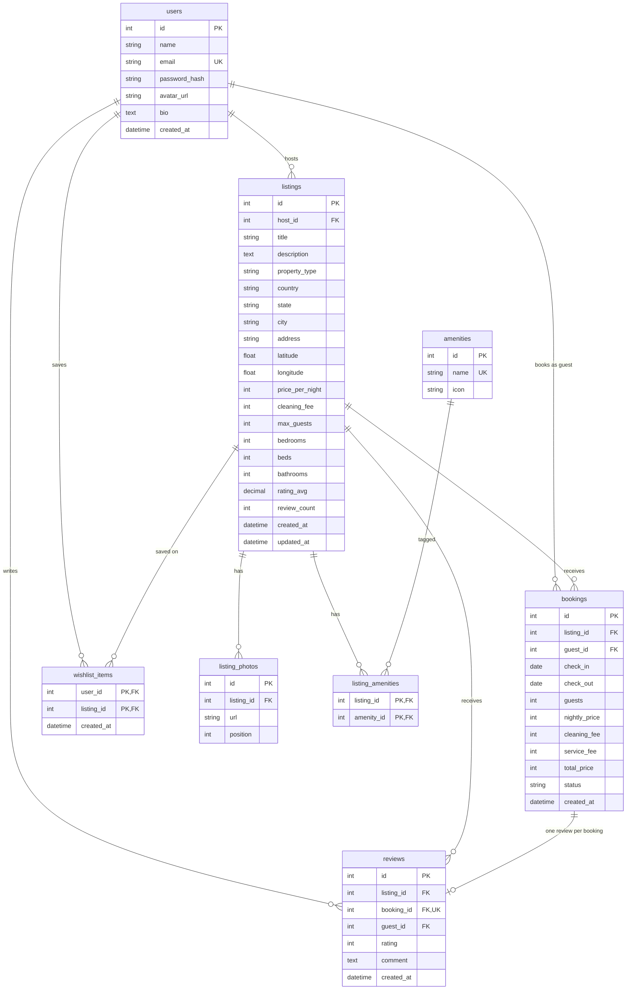

# Airbnb Clone

Monorepo: Next.js frontend + FastAPI backend. UI modeled after Airbnb; payments mocked; seed data uses Indian locations and INR pricing.

## Demo credentials

All seeded accounts share the same password:

| Role | Email | Password |
|------|-------|----------|
| Host | `arjun.host@demo.in` | `Demo@12345` |
| Host | `priya.host@demo.in` | `Demo@12345` |
| Host | `vikram.host@demo.in` | `Demo@12345` |
| Guest | `ananya.guest@demo.in` | `Demo@12345` |
| Guest | `rohit.guest@demo.in` | `Demo@12345` |
| Guest (review demo) | `guest@demo.in` | `Demo@12345` |

The `guest@demo.in` account has a **completed past stay without a review** on the first seeded listing (for testing the review flow later).

## Setup

### Prerequisites

- Node.js 20+
- Python 3.11+ (3.9+ may work for local dev)

### Backend

```bash
cd backend
python3 -m venv .venv
source .venv/bin/activate   # Windows: .venv\Scripts\activate
pip install -r requirements.txt
cp .env.example .env
uvicorn app.main:app --reload --port 8000
```

On startup the API **creates SQLite tables** and runs the **idempotent seed** (skipped if users already exist).

Health check: [http://localhost:8000/api/v1/health](http://localhost:8000/api/v1/health)

### Frontend

```bash
cd frontend
npm install
cp .env.example .env.local
npm run dev
```

App: [http://localhost:3000](http://localhost:3000)

## Tech stack

- **Frontend:** Next.js (App Router), TypeScript, Tailwind CSS, shadcn/ui, TanStack Query, axios, sonner
- **Backend:** FastAPI, SQLAlchemy 2, SQLite, Pydantic v2, JWT (python-jose), bcrypt

## Architecture

- `frontend/src/api/` — plain HTTP functions; `api/client.ts` handles auth, case conversion, and toasts
- `frontend/src/queries/` — TanStack Query hooks (components import from here only)
- `backend/app/routers/` — thin HTTP layer; `services/` for business logic; `seed/` for demo data

## Database schema

SQLite database file defaults to `backend/airbnb.db` (see `DATABASE_URL` in `backend/.env.example`).

### ER diagram



### Seed summary

- **6 users** (3 hosts), **36 listings** across Goa, Jaipur, Udaipur, Mumbai, Bengaluru, Manali, Kochi (Kerala), Delhi, Rishikesh, Pondicherry, Darjeeling
- **5 Unsplash photos** per listing; **8–12 amenities** each; nightly rates **₹1,500–₹25,000**
- **4–12 reviews** per listing with `rating_avg` / `review_count` kept in sync
- **Future bookings** on several listings (blocked dates), **past** stays, plus one **unreviewed** past booking for `guest@demo.in`

## API overview

- Prefix: `/api/v1`
- Lists: `{ items, total, page, page_size, has_next }`
- Mutations: `{ data, message }`
- Errors: `{ message, errors }`

## Assumptions

- Payments are mocked (no payment gateway).
- Prices and fees are in **INR**; UI uses the rupee symbol (₹).
- Deleting a user or listing cascades to dependent rows (photos, bookings, reviews, wishlist links) for simpler demo cleanup.
