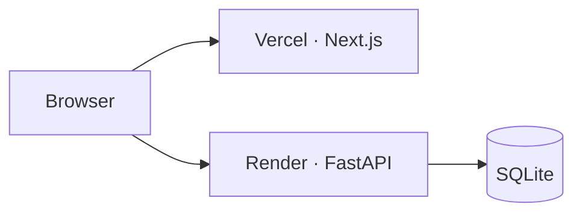

# Airbnb Clone

Full-stack Airbnb-style marketplace: search stays across India, book with mocked checkout, manage trips and wishlists, and host listings. **Next.js + FastAPI + SQLite**, UI aligned with Airbnb’s web patterns (responsive layouts, dark mode). Prices in **INR (₹)**.

---

## Live demo & repository

| | Link |
|---|------|
| **Live application** | **[https://airbnb-clone-jade-one-73.vercel.app](https://airbnb-clone-jade-one-73.vercel.app)** |
| **Backend API** | [https://airbnb-clone-api-kpno.onrender.com](https://airbnb-clone-api-kpno.onrender.com) |
| **API health** | [https://airbnb-clone-api-kpno.onrender.com/api/v1/health](https://airbnb-clone-api-kpno.onrender.com/api/v1/health) |
| **Interactive API docs** | [https://airbnb-clone-api-kpno.onrender.com/docs](https://airbnb-clone-api-kpno.onrender.com/docs) |
| **GitHub** | [https://github.com/yaswanthp2005/airbnb_clone](https://github.com/yaswanthp2005/airbnb_clone) |

Monorepo: **`frontend/`** (Vercel) · **`backend/`** (Render)

> **First load on Render:** if the API was idle, the first request may take **~30–60s** (loading skeletons appear). Refresh once the health URL returns `{"status":"ok"}`.

---

## Screenshots

Visual walkthrough for evaluators

### Home & explore


### Search results & map


### Listing detail


### Booking checkout (mocked payment)


### My trips


### Host dashboard


---

## Quick evaluation guide (~3 minutes)

| Step | Action |
|------|--------|
| 1 | Open the **[live app](https://airbnb-clone-jade-one-73.vercel.app)** → Home or **Search** |
| 2 | Search **Goa**, add dates + guests → on results use **Sort** + **Filters** |
| 3 | Open a listing (`/listings/{slug}`) → **Reserve** → pay with test card **`4242 4242 4242 4242`**, expiry **`12/30`**, CVV **`123`** |
| 4 | User menu → **Log in** as `guest@demo.in` / **`Demo@12345`** → **Trips** (cancel or review) |
| 5 | **Become a host** → create / edit / delete a listing (7-step wizard) |

| Role | Email | Password |
|------|-------|----------|
| Guest (review + cancel demos) | `guest@demo.in` | `Demo@12345` |
| Guest | `ananya.guest@demo.in` | `Demo@12345` |
| Host | `arjun.host@demo.in` | `Demo@12345` |

Sign-up also works via the user menu (modal). All seeded accounts share the same password.

---

## Data persistence (important for the hosted demo)

| Where | What happens |
|-------|----------------|
| **Local dev** (`backend/airbnb.db`) | Bookings, listings, reviews, and wishlists **persist**. Confirmed bookings **block** calendar dates. |
| **Render (this demo)** | SQLite is on **ephemeral disk**. **Restart / redeploy / spin-down resets the DB** and re-seeds demo data. Visitor-created bookings and listings **do not survive**; overlap blocking and CRUD logic are still fully implemented locally. |

For production persistence you would use Postgres (or similar); the assignment’s booking rules are implemented in the service layer regardless of host.

---

## Assignment checklist

| Area | Delivered |
|------|-----------|
| Home & search | Grid cards, URL search (where/when/who), filters, **sort**, amenity bar, infinite scroll, **interactive map** |
| Listing detail | Gallery, amenities, host, reviews, availability, price breakdown, slug URLs |
| Booking | Validation, unavailable dates, mocked checkout, confirmation, **My Trips**, cancel, post-stay reviews |
| Host CRUD | Create / edit / delete listings, dashboard, reservations |
| Airbnb UX | Nav, modals, date pickers, toasts, wishlist, mobile tab bar, dark mode |
| Placeholders | Messages, identity verification, Experiences/Services → Coming soon |
| Bonus | Map pins, reviews after stay, dark mode, responsive layouts |

---

## Engineering highlights (for code review)

These are deliberate choices that affect **UX, correctness, and maintainability**.

### Internationalization (`t()`)

- **All user-visible strings** (UI, validation, toasts) live in [`frontend/src/common/i18n/en.json`](frontend/src/common/i18n/en.json).
- Components call **`t("dotted.key", { vars })`** from [`frontend/src/common/i18n/index.ts`](frontend/src/common/i18n/index.ts) — no hard-coded copy in feature code.
- Pluralization and labels (e.g. trips, listings filters, checkout errors) use the same layer so copy stays consistent and easy to extend to more locales later.

### Server state & cache (TanStack Query)

- **Data flow:** UI → [`frontend/src/queries/`](frontend/src/queries/) hooks → [`frontend/src/api/`](frontend/src/api/) → axios [`client.ts`](frontend/src/api/client.ts). Components do not call axios directly.
- **Stable cache keys:** [`frontend/src/constants/queryKeys.ts`](frontend/src/constants/queryKeys.ts) centralizes keys (`listings.list(filters)`, `bookings.list(tab)`, etc.) so invalidation stays precise.
- **Default policy** ([`frontend/src/utils/queryClient.ts`](frontend/src/utils/queryClient.ts)): `staleTime: Infinity` for most reads (no refetch noise); **`staleTime` overrides** on data that changes often (e.g. unavailable dates, host activity).
- **After mutations:** targeted `invalidateQueries` and shared helper [`invalidateViewerData`](frontend/src/utils/invalidateViewerData.ts) refresh listings, trips, wishlist, and host views when reviews or host listings change.
- **Multi-tab sync:** `BroadcastChannel` invalidates caches when a booking, login, or wishlist change happens in another tab (listings often open in new tabs).
- **Wishlist:** optimistic updates with rollback on failure ([`frontend/src/queries/wishlist.ts`](frontend/src/queries/wishlist.ts)).
- **Infinite lists:** search, wishlist, and host listings use `useInfiniteQuery` + intersection observer for pagination without full page reloads.

### API client & backend contract

- Request/response **camelCase ⇄ snake_case** in the axios layer.
- **JWT** attached automatically; **401** clears session (except login/register failures).
- **Success toasts** from backend `message` on mutations; errors surface as translated toasts (see `en.json` → `errors`).

### URL as source of truth (search)

- Search filters and sort sync to the query string ([`useListingFilters`](frontend/src/components/listings/hooks/useListingFilters.ts), [`filtersFromSearchParams`](frontend/src/components/listings/utils.ts)) — shareable URLs and sane back/forward behavior.

### Backend integrity

- Booking create uses **transactional overlap checks** (SQLite `BEGIN IMMEDIATE`) so two guests cannot book the same nights.
- **Prices computed on the server** ([`backend/app/services/pricing.py`](backend/app/services/pricing.py)) — client breakdown is preview only.
- Public listings addressed by **`slug`**; numeric `id` retained for bookings and host APIs.

---

## Architecture



**Backend layout:** `routers/` → `services/` → SQLAlchemy `models/`. Seed in `backend/app/seed/`.

---

## Tech stack

| Layer | Stack |
|-------|--------|
| Frontend | Next.js 16, React 19, TypeScript, Tailwind v4, TanStack Query v5, axios, sonner, react-leaflet, date-fns |
| Backend | FastAPI, SQLAlchemy 2, Pydantic v2, SQLite, JWT, bcrypt |
| Deploy | Vercel + Render |

---

## Local setup

**Prerequisites:** Node 20+, Python 3.9+.

```bash
# Backend
cd backend && python3 -m venv .venv && source .venv/bin/activate
pip install -r requirements.txt && cp .env.example .env
uvicorn app.main:app --reload --port 8000

# Frontend (new terminal)
cd frontend && npm install && cp .env.example .env.local
# Set NEXT_PUBLIC_API_URL=http://localhost:8000
npm run dev
```

Reset DB: delete `backend/airbnb.db` and restart the API.

```bash
cd frontend && npm run lint && npm run typecheck && npm run build
cd backend && python3 -m compileall -q app
```

### Backend tests

Pytest uses a **temporary SQLite file** (no demo seed) so tests do not touch `airbnb.db`.

```bash
cd backend
pip install -r requirements-dev.txt
pytest
```

Coverage includes pricing quotes, listing slugs, booking overlap / back-to-back stays, auth, and a few HTTP endpoints under `backend/tests/`.

## Environment variables

| Service | Variable | Production example |
|---------|----------|-------------------|
| Frontend | `NEXT_PUBLIC_API_URL` | `https://airbnb-clone-api-kpno.onrender.com` |
| Backend | `CORS_ORIGINS` | `https://airbnb-clone-jade-one-73.vercel.app` |
| Backend | `SECRET_KEY`, `DATABASE_URL`, `SEED_ON_STARTUP` | See `backend/.env.example` |

---

## Database & API (summary)

- **Listings:** unique `slug`, photos, amenities, ratings derived from reviews.
- **Bookings:** status `confirmed` / `cancelled`; nights blocked while confirmed.
- **Reviews:** one per completed booking.

**REST base:** `/api/v1`

| Method | Path | Notes |
|--------|------|--------|
| GET | `/listings` | Search + **`sort`** + filters + pagination |
| GET | `/listings/{slug}` | Detail |
| GET | `/listings/{slug}/unavailable-dates` | Booked nights |
| POST | `/bookings` | Create (409 on overlap) |
| GET | `/bookings/me` | Trips tabs |
| POST | `/reviews` | After completed stay |
| CRUD | `/host/listings` | Host-only (`{id}`) |

Full OpenAPI: [hosted docs](https://airbnb-clone-api-kpno.onrender.com/docs).

**Sort:** `recommended` | `price_asc` | `price_desc` | `rating_desc` | `newest`

---

## Deployment notes

- **Vercel** root: `frontend/` — set `NEXT_PUBLIC_API_URL` to the Render URL (no `/api/v1` suffix).
- **Render** root: `backend/` — health check `/api/v1/health`, single worker for SQLite.
- After deploy, set Render **`CORS_ORIGINS`** to the Vercel URL above.

---

## Limitations (explicit)

- Mocked payments (card not sent to server).
- Auth: JWT in `localStorage`; sign-in/up modal only (decorative Google/Apple buttons).
- Host photos: **URL paste** only (no upload).
- Messages & identity verification: Coming soon pages.

---

## Demo credentials (full)

Password **`Demo@12345`** for all:

| Hosts | Guests |
|-------|--------|
| `arjun.host@demo.in`, `priya.host@demo.in`, `vikram.host@demo.in` | `ananya.guest@demo.in`, `rohit.guest@demo.in`, `guest@demo.in` |

---

## Smoke test

- [ ] Live app loads after API health is OK
- [ ] Search + **sort** + filters; listing opens via **slug** URL
- [ ] Book → trip appears; cancel or review (as `guest@demo.in`)
- [ ] Wishlist heart; host create/edit/delete listing
- [ ] Toasts on success/error; 404 page works
